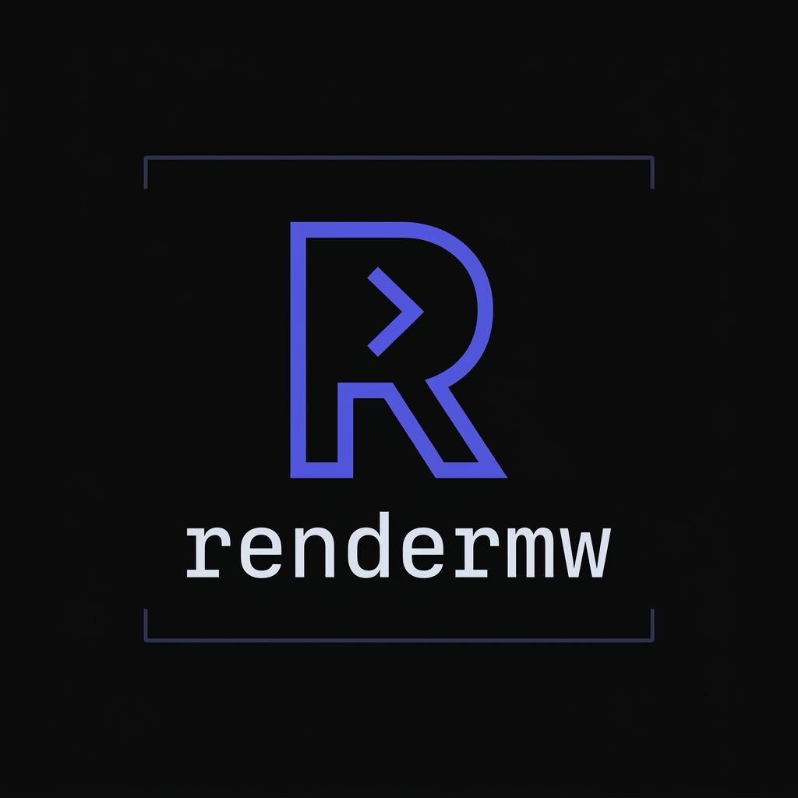
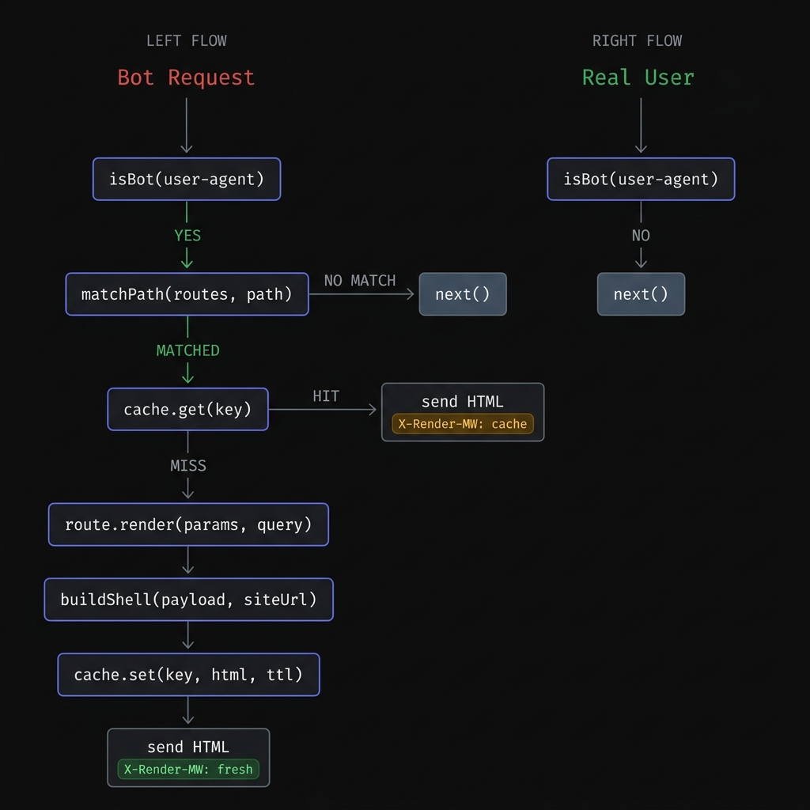

<div align="center">

<br/>



<br/><br/>


<br/><br/>

### *Bots get semantic HTML. Users get your SPA. You get rankings.*

**No Puppeteer &nbsp;·&nbsp; No paid services &nbsp;·&nbsp; No architecture rewrites &nbsp;·&nbsp; No overhead**

<br/>

```bash
npm install rendermw
```

<br/>

[Documentation](#the-problem) &nbsp;·&nbsp; [Quick Start](#quick-start) &nbsp;·&nbsp; [API Reference](#api-reference) &nbsp;·&nbsp; [Code of Conduct](./CODE_OF_CONDUCT.md) &nbsp;·&nbsp; [Security](./SECURITY.md)

<br/>

</div>

---

## The problem

When Googlebot crawls your React, Vue, or Angular app, it sees this:

```html
<!DOCTYPE html>
<html>
  <body>
    <div id="root"></div>
    <script src="/bundle.js"></script>
  </body>
</html>
```

Your products, articles, and pages are **completely invisible** to every search engine and social crawler.
Zero indexing. Zero rich results. Zero rankings.

**Every existing fix has a painful cost:**

| Solution | The catch |
|:---|:---|
|  **Puppeteer / Rendertron** | Spawns a Chrome instance per request. Slow, expensive, crashes under load |
|  **Prerender.io** | $99–$449/month. All bot traffic routes through a third-party service |
|  **Migrate to Next.js / Nuxt** | Rewrite your entire frontend. Weeks of work. Massive risk |

**rendermw solves it in an afternoon.** Describe each route's data as a plain async function. rendermw builds the complete HTML document — title, description, canonical, Open Graph, Twitter Card, JSON-LD schema, BreadcrumbList — and serves it to bots. Real users pass through untouched.

---

## How it works

<div align="center">



</div>

---

## Installation

```bash
npm install rendermw
```

> **Peer dependency:** Express ≥ 4.0.0
> ```bash
> npm install express
> ```

TypeScript types are included — no `@types/rendermw` needed.

---

## Quick start

```js
const express = require('express');
const rendermw = require('rendermw');

const app = express();

app.use(rendermw({
  siteUrl: 'https://mystore.com',
  routes: [
    {
      path: '/products/:slug',
      render: async ({ slug }) => {
        const product = await db.products.findBySlug(slug);

        return {
          title:       `${product.name} — My Store`,
          description: product.description,
          canonical:   `https://mystore.com/products/${slug}`,
          ogImage:     product.imageUrl,
          ogType:      'product',
          schema: {
            '@context': 'https://schema.org',
            '@type':    'Product',
            name:       product.name,
            offers: {
              '@type':        'Offer',
              price:          product.price,
              priceCurrency:  'USD',
              availability:   'https://schema.org/InStock',
            },
          },
          breadcrumbs: [
            { name: 'Home',     url: 'https://mystore.com' },
            { name: 'Products', url: 'https://mystore.com/products' },
            { name: product.name, url: `https://mystore.com/products/${slug}` },
          ],
          html: `
            <main>
              <h1>${product.name}</h1>
              <p>${product.description}</p>
              <p><strong>$${product.price}</strong></p>
            </main>
          `,
        };
      },
    },
  ],
}));

// SPA fallback — real users always land here
app.get('*', (_req, res) => res.sendFile('index.html', { root: './dist' }));

app.listen(3000);
```

---

## TypeScript

```ts
import express from 'express';
import rendermw from 'rendermw';
import type { RenderPayload, RenderOptions } from 'rendermw';

const app = express();

const options: RenderOptions = {
  siteUrl: 'https://mystore.com',
  routes: [
    {
      path: '/products/:slug',
      render: async ({ slug }): Promise<RenderPayload> => ({
        title:       `${slug} — My Store`,
        description: 'Premium products.',
        canonical:   `https://mystore.com/products/${slug}`,
        html:        `<h1>${slug}</h1>`,
      }),
    },
  ],
};

app.use(rendermw(options));
app.get('*', (_req, res) => res.sendFile('index.html', { root: './dist' }));
app.listen(3000);
```

---

## API Reference

### `rendermw(options)` → `RequestHandler`

#### `RenderOptions`

| Option | Type | Default | Description |
|:---|:---|:---:|:---|
| `siteUrl` | `string` | **required** | Base URL e.g. `"https://example.com"`. Resolves relative OG image paths. |
| `routes` | `RenderRoute[]` | **required** | Routes rendermw intercepts for bots. |
| `cache` | `boolean` | `true` | Enable in-memory HTML cache. |
| `cacheTTL` | `number` | `86400` | Cache TTL in seconds. Default: 24 hours. |
| `bots` | `string[]` | `[]` | Extra bot UA substrings beyond the built-in list. |
| `debug` | `boolean` | `false` | Log every bot hit to console. |

---

#### `RenderRoute`

| Field | Type | Description |
|:---|:---|:---|
| `path` | `string` | Express-style pattern e.g. `"/products/:slug"` |
| `render` | `(params, query) => Promise<RenderPayload>` | Called when a bot matches this route. |

`render()` receives:
- `params` — `Record<string, string>` — URL path params e.g. `{ slug: "nike-air-max" }`
- `query` — `Record<string, string>` — query string e.g. `{ page: "2", sort: "price" }`

---

#### `RenderPayload`

| Field | Type | Req | Description |
|:---|:---|:---:|:---|
| `title` | `string` | ✅ | `<title>` · `og:title` · `twitter:title` |
| `description` | `string` | ✅ | `<meta name="description">` · OG · Twitter |
| `canonical` | `string` | ✅ | `<link rel="canonical">` · `og:url` |
| `html` | `string` | ✅ | Semantic body HTML served to bots |
| `ogImage` | `string` | — | OG / Twitter image. Relative paths resolved against `siteUrl` |
| `ogType` | `string` | — | Defaults to `"website"`. Use `"article"` or `"product"` |
| `schema` | `object \| object[]` | — | Raw JSON-LD. Arrays emit one `<script>` tag per item |
| `breadcrumbs` | `Breadcrumb[]` | — | Auto-converted to `BreadcrumbList` JSON-LD |
| `lang` | `string` | — | `<html lang="">`. Defaults to `"en"` |

---

### HTML output

Every bot response is a complete, valid HTML document:

```html
<!DOCTYPE html>
<html lang="en">
<head>
  <meta charset="UTF-8">
  <meta name="viewport" content="width=device-width, initial-scale=1.0">
  <title>Nike Air Max 270 — My Store</title>
  <meta name="description" content="Experience the biggest Air unit yet.">
  <link rel="canonical" href="https://mystore.com/products/nike-air-max">
  <meta name="robots" content="index, follow, max-image-preview:large, max-snippet:-1, max-video-preview:-1">

  <!-- Open Graph -->
  <meta property="og:title"       content="Nike Air Max 270 — My Store">
  <meta property="og:description" content="Experience the biggest Air unit yet.">
  <meta property="og:url"         content="https://mystore.com/products/nike-air-max">
  <meta property="og:type"        content="product">
  <meta property="og:image"       content="https://mystore.com/images/nike-air-max.jpg">

  <!-- Twitter Card -->
  <meta name="twitter:card"        content="summary_large_image">
  <meta name="twitter:title"       content="Nike Air Max 270 — My Store">
  <meta name="twitter:description" content="Experience the biggest Air unit yet.">
  <meta name="twitter:image"       content="https://mystore.com/images/nike-air-max.jpg">

  <!-- JSON-LD: Product -->
  <script type="application/ld+json">
  { "@context": "https://schema.org", "@type": "Product", "name": "Nike Air Max 270", ... }
  </script>

  <!-- JSON-LD: BreadcrumbList -->
  <script type="application/ld+json">
  { "@context": "https://schema.org", "@type": "BreadcrumbList", "itemListElement": [ ... ] }
  </script>
</head>
<body>
  <main>
    <h1>Nike Air Max 270</h1>
    <p>Experience the biggest Air unit yet.</p>
  </main>
</body>
</html>
```

---

## Route matching

Supports Express-style `:param` segments. Segment count must match exactly.

```
Pattern                  Path                          Params extracted
─────────────────────────────────────────────────────────────────────────
/                        /                             {}
/about                   /about                        {}
/products/:slug          /products/nike-air-max        { slug: "nike-air-max" }
/blog/:slug              /blog/hello-world             { slug: "hello-world" }
/shop/:cat/:id           /shop/shoes/12345             { cat: "shoes", id: "12345" }
/products/:slug          /blog/hello-world             ✗  no match → next()
/products/:slug          /products/shoes/red           ✗  no match → next()
```

URL-encoded characters are decoded automatically via `decodeURIComponent`.

---

## Schema markup

### Product with rich results

```js
schema: {
  '@context': 'https://schema.org',
  '@type':    'Product',
  name:        product.name,
  description: product.description,
  image:      `https://mystore.com${product.imageUrl}`,
  offers: {
    '@type':        'Offer',
    price:          product.price,
    priceCurrency:  'USD',
    availability:   'https://schema.org/InStock',
    url:           `https://mystore.com/products/${product.slug}`,
  },
  aggregateRating: {
    '@type':      'AggregateRating',
    ratingValue:   product.rating,
    reviewCount:   product.reviewCount,
  },
}
```

### Article / Blog post

```js
schema: {
  '@context':      'https://schema.org',
  '@type':         'Article',
  headline:         post.title,
  description:      post.excerpt,
  author:         { '@type': 'Person', name: post.author },
  datePublished:    post.publishedAt.toISOString(),
  dateModified:     post.updatedAt.toISOString(),
  publisher: {
    '@type': 'Organization',
    name:    'My Store',
    logo:  { '@type': 'ImageObject', url: 'https://mystore.com/logo.png' },
  },
}
```

### Multiple schemas on one page

```js
// Each item in the array gets its own <script type="application/ld+json"> tag
schema: [
  { '@type': 'Product', name: product.name, ... },
  { '@type': 'FAQPage', mainEntity: [ ... ] },
]
```

---

## Breadcrumbs

Pass a `breadcrumbs` array — rendermw auto-generates the `BreadcrumbList` JSON-LD. No extra code needed.

```js
breadcrumbs: [
  { name: 'Home',           url: 'https://mystore.com' },
  { name: 'Products',       url: 'https://mystore.com/products' },
  { name: 'Sneakers',       url: 'https://mystore.com/products/sneakers' },
  { name: 'Nike Air Max',   url: 'https://mystore.com/products/nike-air-max' },
],
```

Produces:

```json
{
  "@context": "https://schema.org",
  "@type": "BreadcrumbList",
  "itemListElement": [
    { "@type": "ListItem", "position": 1, "name": "Home",         "item": "https://mystore.com" },
    { "@type": "ListItem", "position": 2, "name": "Products",     "item": "https://mystore.com/products" },
    { "@type": "ListItem", "position": 3, "name": "Sneakers",     "item": "https://mystore.com/products/sneakers" },
    { "@type": "ListItem", "position": 4, "name": "Nike Air Max", "item": "https://mystore.com/products/nike-air-max" }
  ]
}
```

Or build it manually with `buildBreadcrumbSchema()` and merge into a schema array:

```js
import { buildBreadcrumbSchema } from 'rendermw';

schema: [
  { '@type': 'Product', ... },
  buildBreadcrumbSchema([
    { name: 'Home',    url: 'https://mystore.com' },
    { name: product.name, url: `https://mystore.com/products/${slug}` },
  ]),
]
```

---

## OG image resolution

Pass absolute or relative paths — rendermw resolves them automatically:

```js
// ✅ Already absolute — used as-is
ogImage: 'https://cdn.mystore.com/images/shoes.jpg'

// ✅ Relative with leading slash — siteUrl prepended
ogImage: '/images/shoes.jpg'
// → https://mystore.com/images/shoes.jpg

// ✅ Relative without leading slash — siteUrl + / prepended
ogImage: 'images/shoes.jpg'
// → https://mystore.com/images/shoes.jpg
```

---

## Caching

rendermw ships a zero-dependency in-memory TTL cache. No Redis. No filesystem. Just a `Map`.

```
Cache key = req.path + JSON.stringify(req.query)
```

- `/search?q=shoes` and `/search?q=hats` are **separate cache entries**
- Eviction is **lazy** — expired entries are deleted on read, not by a background timer
- Cache resets on **server restart** — perfect for rolling deploys

```js
rendermw({
  siteUrl:  'https://mystore.com',
  cache:    true,
  cacheTTL: 3600,   // 1 hour
  routes:  [ ... ],
})
```

**Disable during development:**

```js
rendermw({ cache: false, ... })
// render() is called fresh on every bot request
```

**Use `RenderCache` directly for programmatic control:**

```js
import { RenderCache } from 'rendermw';

const cache = new RenderCache();
cache.set('/products/shoes', html, 3600);
cache.get('/products/shoes');   // string | null
cache.delete('/products/shoes');
cache.clear();
cache.size();                   // number of entries
```

**Multi-instance / Redis layer:**

```js
{
  path: '/products/:slug',
  render: async ({ slug }) => {
    const hit = await redis.get(`bot:product:${slug}`);
    if (hit) return JSON.parse(hit);

    const product = await db.products.findBySlug(slug);
    const payload = buildPayload(product);

    await redis.set(`bot:product:${slug}`, JSON.stringify(payload), 'EX', 86400);
    return payload;
  },
}
```

---

## Debug mode

```js
rendermw({ debug: true, ... })
```

```
[rendermw] 2024-01-15T10:32:11.482Z | BOT | Googlebot/2.1 | /products/nike-air-max | CACHE MISS | route: /products/:slug
[rendermw] 2024-01-15T10:32:12.104Z | BOT | Googlebot/2.1 | /products/nike-air-max | CACHE HIT  | route: /products/:slug
[rendermw] 2024-01-15T10:33:01.002Z | BOT | Twitterbot/1.0 | /blog/hello-world     | CACHE MISS | route: /blog/:slug
[rendermw] 2024-01-15T10:34:10.554Z | BOT | LinkedInBot/1.0 | /                    | NO ROUTE
```

---

## Response headers

| Header | Values | Description |
|:---|:---|:---|
| `Content-Type` | `text/html; charset=utf-8` | Always HTML |
| `X-Render-MW` | `fresh` · `cache` | Whether this was rendered now or served from cache |
| `X-Render-Route` | e.g. `/products/:slug` | The route pattern that matched |

Verify rendermw is working without touching your logs:

```bash
curl -sI -A "Googlebot" https://mystore.com/products/nike-air-max | grep -i x-render
# X-Render-MW: fresh
# X-Render-Route: /products/:slug
```

---

## Built-in bot list

All matching is **case-insensitive substring** — partial matches work.

| Category | Bots |
|:---|:---|
| **Google** | `Googlebot` · `Googlebot-Image` · `Googlebot-Video` · `Google-InspectionTool` · `Mediapartners-Google` · `AdsBot-Google` · `APIs-Google` · `Google Favicon` |
| **Search engines** | `Bingbot` · `Slurp` · `DuckDuckBot` · `Baiduspider` · `YandexBot` · `Sogou` · `Exabot` |
| **Social** | `facebookexternalhit` · `facebot` · `Twitterbot` · `LinkedInBot` · `WhatsApp` · `TelegramBot` · `Discordbot` · `Slackbot` · `Applebot` · `Pinterestbot` |
| **SEO tools** | `Semrushbot` · `Ahrefsbot` · `Mj12bot` · `DotBot` · `Screaming Frog` |
| **Auditing** | `GTmetrix` · `Lighthouse` |

**Add your own:**

```js
rendermw({
  bots: ['my-internal-crawler', 'monitoring-bot/2.0'],
  ...
})
```

---

## Error handling

If your `render()` throws, rendermw:

1. Logs the error to `console.error`
2. Calls `next()` — your normal Express handler responds
3. The bot receives your SPA shell (same as without rendermw)
4. **The server never crashes**

```
[rendermw] ERROR rendering /products/broken-slug (route: /products/:slug): Error: Connection timeout
    at Object.render (server.js:42:11)
    ...
```

No need to wrap render functions in try/catch — rendermw handles it for you.

---

## Production patterns

### With Prisma

```js
const { PrismaClient } = require('@prisma/client');
const prisma = new PrismaClient();

rendermw({
  siteUrl:  'https://mystore.com',
  cacheTTL: 86400,
  routes: [
    {
      path: '/products/:slug',
      render: async ({ slug }) => {
        const product = await prisma.product.findUnique({ where: { slug } });
        if (!product) return {
          title:       'Product Not Found',
          description: 'This product does not exist.',
          canonical:  `https://mystore.com/products/${slug}`,
          html:        '<h1>Not Found</h1>',
        };

        return {
          title:       `${product.name} — My Store`,
          description:  product.description,
          canonical:   `https://mystore.com/products/${slug}`,
          ogImage:      product.imageUrl,
          html:        `<h1>${product.name}</h1><p>${product.description}</p>`,
        };
      },
    },
  ],
});
```

### With CDN / reverse proxy caching

```js
// Add upstream caching headers only for rendermw responses
app.use((req, res, next) => {
  res.on('finish', () => {
    if (res.getHeader('X-Render-MW')) {
      res.setHeader('Cache-Control', 'public, max-age=3600, s-maxage=86400');
    }
  });
  next();
});

app.use(rendermw({ ... }));
```

### Cache invalidation on deploy

The cache is in-memory — it resets on every server restart automatically. Rolling deploys, `pm2 reload`, and container restarts all flush the cache cleanly with no manual intervention.

---

## Exported utilities

```ts
import rendermw, {
  isBot,
  RenderCache,
  buildJsonLd,
  buildBreadcrumbSchema,
  buildShell,
} from 'rendermw';

import type {
  RenderOptions,
  RenderRoute,
  RenderPayload,
  Breadcrumb,
} from 'rendermw';
```

| Export | Type | Description |
|:---|:---|:---|
| `default` | `(options) => RequestHandler` | Middleware factory |
| `isBot` | `(ua, extraBots?) => boolean` | Bot detection |
| `RenderCache` | `class` | TTL cache |
| `buildJsonLd` | `(schema) => string` | Builds `<script type="application/ld+json">` |
| `buildBreadcrumbSchema` | `(breadcrumbs) => object` | `BreadcrumbList` JSON-LD object |
| `buildShell` | `(payload, siteUrl) => string` | Full HTML document builder |

---

## FAQ

<details>
<summary><strong>Is this cloaking?</strong></summary>

No. Google defines cloaking as serving different content to manipulate rankings. rendermw serves the **same data** that would be visible to a real user — pre-built as HTML rather than hydrated client-side. This is Google's officially recommended [dynamic rendering](https://developers.google.com/search/docs/crawling-indexing/javascript/dynamic-rendering) pattern.

</details>

<details>
<summary><strong>Does it work with Vite / CRA / custom builds?</strong></summary>

Yes. rendermw operates at the Express middleware layer — before your SPA bundle is served. It has no opinion about your frontend build tool. React, Vue, Angular, Svelte, vanilla JS — all supported.

</details>

<details>
<summary><strong>Does it work with TypeScript?</strong></summary>

Yes. rendermw is written in TypeScript and ships full `.d.ts` declarations. All types are exported.

</details>

<details>
<summary><strong>Does it support query strings?</strong></summary>

Yes. Query params are passed as the second argument to `render(params, query)` and are factored into the cache key — so `/search?q=shoes` and `/search?q=hats` are stored and served independently.

</details>

<details>
<summary><strong>What if a route isn't in my routes list?</strong></summary>

rendermw calls `next()`. The bot gets your normal Express response — usually your SPA shell. No errors, no crashes.

</details>

<details>
<summary><strong>Can I use it with Express Router?</strong></summary>

Yes — mount it on a router exactly like `app.use()`.

</details>

<details>
<summary><strong>Is there a size limit on cached HTML?</strong></summary>

No hard limit. The cache is a plain `Map` bounded only by process memory. For most sites — hundreds of unique bot-visited URLs, each a few KB of HTML — this is negligible.

</details>

<details>
<summary><strong>Will it slow down real users?</strong></summary>

No. The `isBot()` check is the very first thing that runs — a simple string lowercase + substring match. If it returns false, the middleware returns immediately. There is literally zero overhead for real users beyond a microsecond string check.

</details>

---

## Real world results

A high-traffic e-commerce platform running a React SPA on Express had zero organic search visibility — Googlebot was indexing empty shells. Traditional SSR would have required rewriting thousands of components. Puppeteer prerendering was too slow and crashed under load.

After integrating rendermw and describing each route's data as a plain async function, Googlebot began receiving complete HTML documents with `Product`, `BreadcrumbList`, and `Offer` schema — within 24 hours of deployment. No frontend changes. No architecture rewrite. No paid services.

---

## Benchmarks

All numbers are measured on real hardware with Node.js v22. Run them yourself:

```bash
npm run build
node bench/bench.js
```

```
rendermw benchmark  (500,000 iterations each)

  Benchmark                                             Speed          Throughput
  ───────────────────────────────────────────────────────────────────────────────
  isBot() — non-bot (Chrome UA)                   701.1 ns/op       1.43M ops/sec
  isBot() — Googlebot                              37.4 ns/op      26.74M ops/sec
  isBot() — Twitterbot                            124.9 ns/op       8.01M ops/sec
  isBot() — with 5 extra custom bots              722.4 ns/op       1.38M ops/sec
  RenderCache.get() — hit                          37.7 ns/op      26.53M ops/sec
  RenderCache.get() — miss                           6.5 ns/op     153.95M ops/sec
  RenderCache.set() — new key                     785.1 ns/op       1.27M ops/sec
  matchPath() — no match                          114.5 ns/op       8.73M ops/sec
  matchPath() — match, 1 param                    336.7 ns/op       2.97M ops/sec
  matchPath() — match, 2 params                   429.9 ns/op       2.33M ops/sec
  buildShell() — minimal payload                  118.5 ns/op       8.44M ops/sec
  buildShell() — full (schema + breadcrumbs + OG)   5.92 µs/op       0.17M ops/sec

  Measured on Node.js v22.22.2 — linux x64
```

### What the numbers mean

| Scenario | Latency | Notes |
|:---|---:|:---|
| **Non-bot request overhead** | ~701 ns | The entire cost for a real user. One lowercase + substring scan. |
| **Bot detection (Googlebot)** | ~37 ns | Matches early in the list. |
| **Cache hit** | ~38 ns | Map lookup + expiry check. |
| **Cache miss** | ~7 ns | Map lookup only, key absent. |
| **Route match** | ~337 ns | Split + iterate segments. |
| **Full HTML shell (minimal)** | ~119 ns | Template string assembly, no schema. |
| **Full HTML shell (complete)** | ~5.9 µs | Includes JSON.stringify for schema + breadcrumbs. |

**Real-world latency budget for a bot, cache miss:**

```
isBot()        ~0.7 µs
matchPath()    ~0.4 µs
cache.get()    ~0.04 µs
route.render() your DB query (e.g. 2–20 ms)
buildShell()   ~6 µs
cache.set()    ~0.8 µs
               ────────
Total overhead ~8 µs  +  your DB latency
```

The middleware itself adds less than **10 microseconds** of overhead. Your database is the only variable.

---

## Contributing

```bash
git clone https://github.com/brighteyekid/rendermw
cd rendermw
npm install

npm test           # 108 tests across 5 suites
npm run build      # compile TypeScript to dist/
node bench/bench.js  # run benchmarks
```

All source lives in `src/`. Tests in `tests/`. PRs and issues welcome.

---

<div align="center">

**MIT License** · Made by [Chandra Bhayal](https://github.com/brighteyekid)

*If rendermw helped you, consider starring the repo *

</div>
